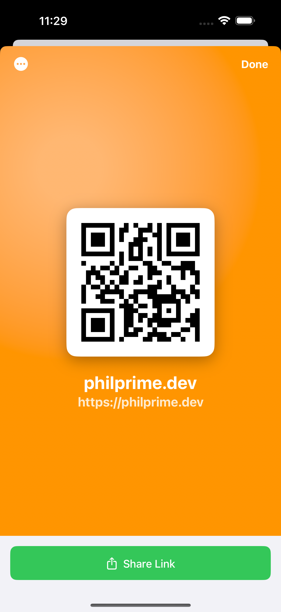
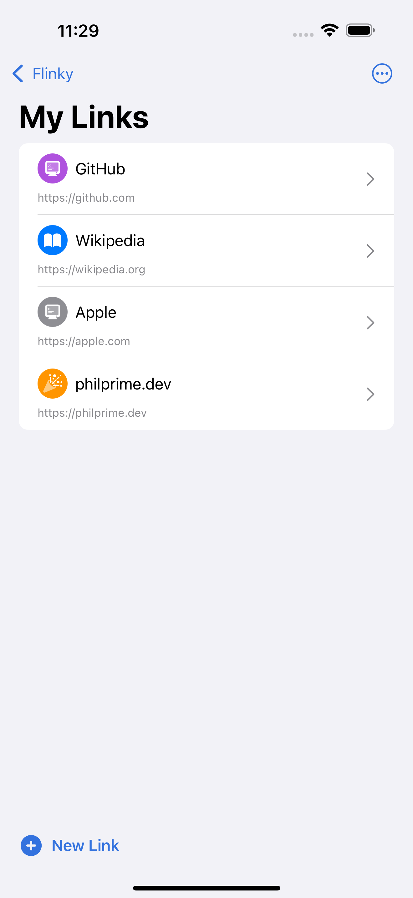
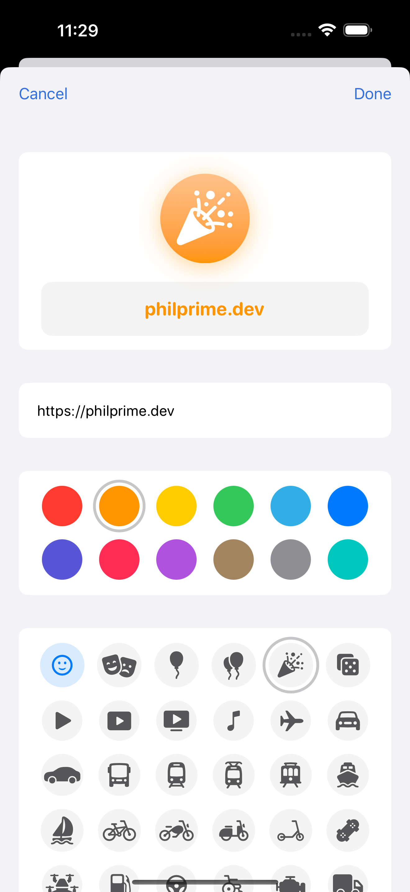
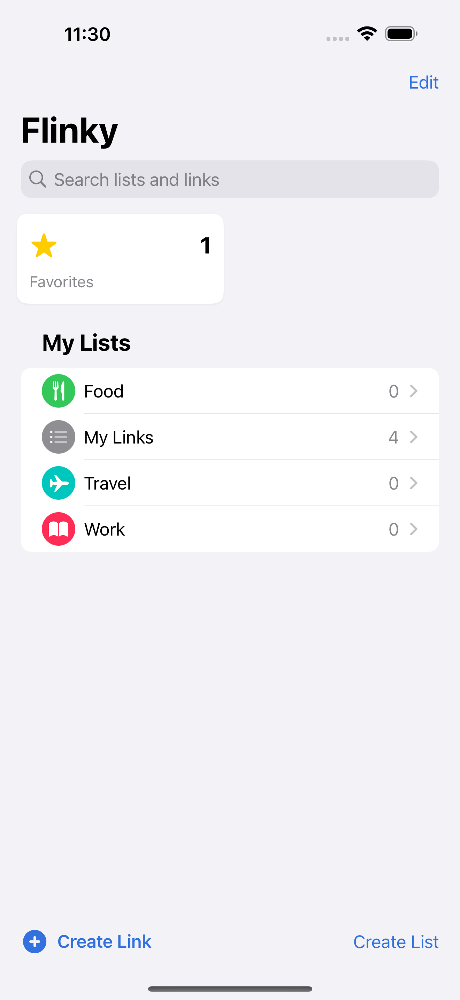

<h1 align="center">
   
   
   
  Flinky
   
</h1>

<h4 align="center">The fastest way to turn links into QR codes on your iPhone.</h4>

  
  
  
  

  <a href="#features">Features</a> •
  <a href="#download">Download</a> •
  <a href="CONTRIBUTING.md">Contributing</a> •
  <a href="Documentation/">Documentation</a> •
  <a href="#development">Development</a> •
  <a href="#support">Support</a>

Turn any link into a **scannable QR code instantly**. Perfect for sharing social profiles, portfolios, WiFi passwords, or any URL without typing. Your links stay **completely private** on your device.

✨ **No typing. No cloud. No tracking. Just scan and go.**

  

## Core Features

- 🔗 **Instant QR codes** - Generate a QR code from any URL with one tap
- 📚 **Organize your links** - Create custom lists with colors and symbols
- 📤 **Share anywhere** - Via QR codes, system share sheet, or NFC
- 🔍 **Find quickly** - Search through your growing collection

## Privacy focused and lightning fast

- 🔒 **Local storage** - Your links stay on your device, no cloud required
- ⚡ **Offline first** - Works completely without internet connection
- 🎨 **Beautiful design** - Minimal interface with dark mode support
- ♿ **Accessibility** - Full VoiceOver support and semantic labeling
- 📊 Anonymous crash reports help us improve the app

## All the must haves

- 📱 Optimized for **iPhone** with native SwiftUI interface
- 🌍 Available in multiple **languages**
- 🎭 Choose from **hundreds of SF Symbols** and 12 colors
- 🌙 QR codes automatically **adapt to light and dark modes**
- 📌 **Pin important lists** for quick access
- 💾 Built with **SwiftData** for reliable local storage

This application is perfect for creators, students, professionals, and anyone who shares links regularly. Whether it's social profiles, portfolios, payment links, or WiFi passwords — Flinky makes sharing instant and effortless. No login required, no subscriptions, just pure functionality.

## How it works

  <table>
    <tr>
      <td align="center" width="200">
        <strong>Generate QR codes</strong>
      </td>
      <td align="center" width="200">
        <strong>Add links</strong>
      </td>
      <td align="center" width="200">
        <strong>Customize as you wish</strong>
      </td>
      <td align="center" width="200">
        <strong>Organize in lists</strong>
      </td>
    </tr>
    <tr>
      <td align="center">
        
      </td>
      <td align="center">
        
      </td>
      <td align="center">
        
      </td>
      <td align="center">
        
      </td>
    </tr>
  </table>

## Download

  

**Open Source**: Flinky is completely open source! You can build it yourself if you prefer, just please don't redistribute compiled binaries — the App Store remains our official distribution channel.

## Support our work

Flinky is a personal project crafted with love by [Philip Niedertscheider](https://github.com/philprime).

Every download and GitHub star helps us dedicate more time to making Flinky even better! Here's how you can support:

- 🍎 **Download on App Store** - [Get Flinky](https://apps.apple.com/us/app/flinky/id6748324734) and leave a review
- ⭐ **Star this repo** - Help others discover Flinky
- 💖 **Sponsor development** - [GitHub Sponsors](https://github.com/sponsors/philprime)
- 📢 **Share with friends** - Spread the word about effortless link sharing

## Contributing

Contributions are welcome! Please see [CONTRIBUTING.md](CONTRIBUTING.md) for development setup, guidelines, and detailed documentation.

## Get help

- 📧 **[Email Support](mailto:support@techprimate.com)** - Direct help for any questions
- 🐛 **[Report Issues](https://github.com/techprimate/Flinky/issues)** - Bug reports and feature requests
- 📖 **[Documentation](Documentation/)** - Detailed guides and technical docs

## License

This project is open source under the MIT License. See [LICENSE](LICENSE) for details.

**This software and all its features are free for everyone to use and enjoy.** You're welcome to study, modify, and compile the code for personal use. However, please don't redistribute compiled binaries — the App Store remains the official distribution channel to ensure quality and support.
